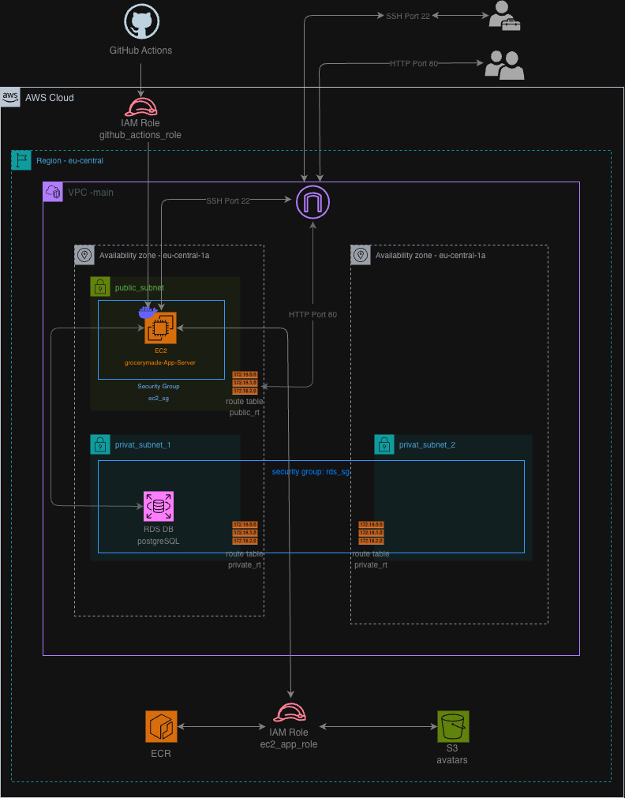

# GroceryMate Infrastructure & CI/CD Pipeline

This repository contains the Infrastructure as Code (IaC) and deployment pipelines for **GroceryMate**, a cloud-native web application. Built as part of the Masterschool Cloud Engineer track, this project provisions a secure, AWS environment using **Terraform** and automates application delivery using **Docker** and **GitHub Actions**.

 

## Infrastructure Components & Dependencies

The infrastructure is provisioned entirely via Terraform and is divided into logical tiers to ensure security, scalability, and separation of concerns.

* **Networking:** The foundation is a custom Virtual Private Cloud (VPC) using the `10.0.0.0/16` CIDR block. It includes an Internet Gateway for external access.
* **Public Subnet:** Located in `eu-central-1a`, this subnet routes traffic to the Internet Gateway and hosts the application server.
* **Private Subnets:** Two isolated subnets located in `eu-central-1a` and `eu-central-1b` with no direct internet access. They are dedicated exclusively to the database to maximize security.
* **Compute (EC2):** A `t2.micro` instance running Amazon Linux 2023 acts as the application server. It automatically installs Docker, the PostgreSQL client, and the Amazon ECR credential helper upon boot. 
* **Database (RDS):** A PostgreSQL 15 database (`db.t3.micro`) resides in a subnet group spanning the two private subnets. It strictly depends on an RDS Security Group that only accepts inbound traffic from the EC2 instance.
* **Storage (S3):** An S3 bucket (`grocerymate-avatars-24111983`) securely stores user-uploaded avatars.
* **Container Registry (ECR):** An Amazon ECR repository (`grocerymate-app`) stores the application's Docker images with "scan on push" enabled for automated vulnerability detection.

## The "Why" of IAM Roles

A core focus of this project is following the principle of least privilege. Hardcoded AWS access keys are a major security risk, so this architecture relies entirely on AWS Identity and Access Management (IAM) Roles.

* **EC2 Instance Profile:** Instead of storing AWS credentials on the server, the EC2 instance assumes a dedicated IAM Role (`grocerymate-ec2-app-role`). This role grants the exact permissions needed to read images from ECR and manage files in the S3 bucket. 
* **GitHub Actions OIDC:** To securely deploy code, GitHub Actions authenticates with AWS using OpenID Connect (OIDC) rather than long-lived secret keys. 
* **Strict Repository Trust:** The AWS OIDC trust policy explicitly verifies the GitHub repository name, ensuring only this specific project can assume the deployment role.

## CI/CD Workflow

The deployment pipeline is fully automated via GitHub Actions (`deploy.yml`) and triggers automatically upon a push to the `version2` branch. Here is how the application transitions from code to a live cloud environment:

* **Authentication:** The GitHub Runner assumes the `grocerymate-github-actions-role` via OIDC to securely interact with the AWS environment.
* **Build & Push:** The pipeline builds the Python application into a Docker container (using the provided `Dockerfile`), tags it, and pushes the fresh image to the Amazon ECR repository.
* **Dynamic Security Group Whitelisting:** For maximum security, port 22 (SSH) on the EC2 instance is closed by default. The pipeline temporarily injects the GitHub Runner's IP address into the EC2 Security Group.
* **Database Migration:** The pipeline securely copies the database schema file to the EC2 instance via SCP.
* **Deployment Execution:** The pipeline SSHes into the EC2 instance, runs the PostgreSQL migrations, pulls the new Docker image from ECR, and replaces the old container. The new container maps host port 80 to container port 5000 and is injected with secure environment variables.
* **Security Hardening:** A cleanup step immediately revokes the GitHub Runner's IP address from the Security Group, closing the SSH port once the deployment completes.
* **Smoke Testing:** The pipeline finishes by pinging the live server's public IP on port 80 to verify the GroceryMate application is successfully responding to HTTP requests.